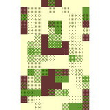
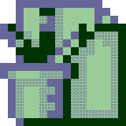
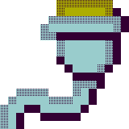

<!DOCTYPE html>
<html lang=pt-BR dir="ltr">

<head>
  <meta charset="utf-8">
  <title>guil&lt;h̍̇ͫ̅҉̟͙̜̘̙̬̗̠̠̦ͅ&gt;erme souza</title>

  <link rel="icon" type="image/png" href="favicon.png">

  <link href="index.css" rel="stylesheet" type="text/css">

  <link href="https://fonts.googleapis.com/css2?family=Major+Mono+Display&family=Ubuntu:ital,wght@0,400;0,700;1,400&family=VT323&display=swap" rel="stylesheet">

</head>

<body class="home">
  
&lt;h̍̇ͫ̅҉̟͙̜̘̙̬&gt;

  <h1>GUILERME SOUZA</h1>
  <h2>pesquisador // educador // designer // artista</h2>
             
  </a>
  

  

      
      
      
      
      
      
  

       
  

    <ul class="bottomnav">
      <a href="https://www.instagram.com/guilerms" target="_blank">
        <li>instagram</li>
      </a> //
      <a href="https://www.linkedin.com/in/guilherme-souza-481378b2" target="_blank">
        <li>linkedin</li>
      </a> //
      <a href="https://www.behance.net/guilermesouza" target="_blank">
        <li>behance</li>
      </a> //
      <a href="https://github.com/guilerms" target="_blank">
        <li>github</li>
      </a> //
      <a href="https://twitter.com/guilerms" target="_blank">
        <li>twitter</li>
      </a> //
      <a href="mailto:glm.a.souza@gmail.com" target="_blank">
        <li>e-mail</li>
      </a> //
      <a href="LICENSE" target="_blank">
        <li>cc by-sa 4.0</li>
      </a>
    </ul>
  

</body>

</html>
